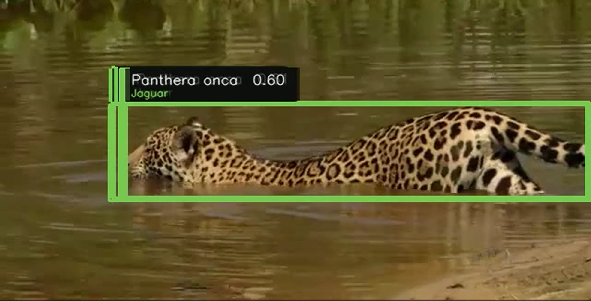
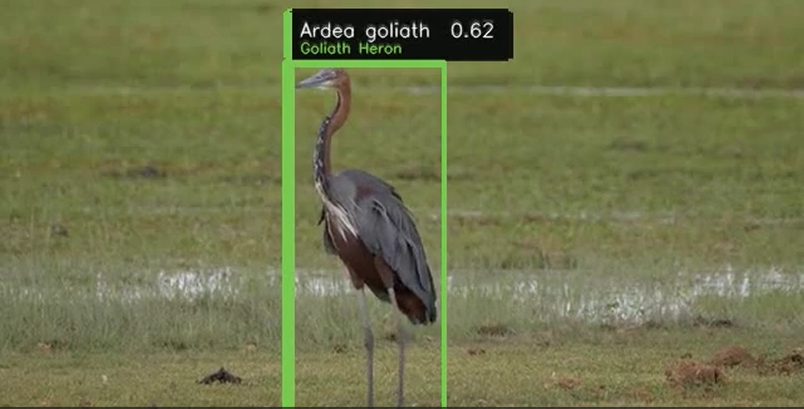
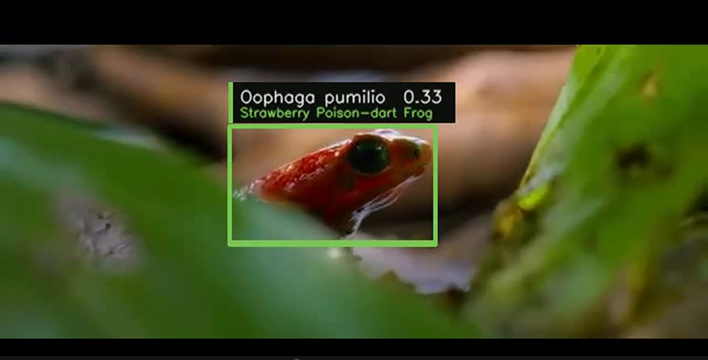
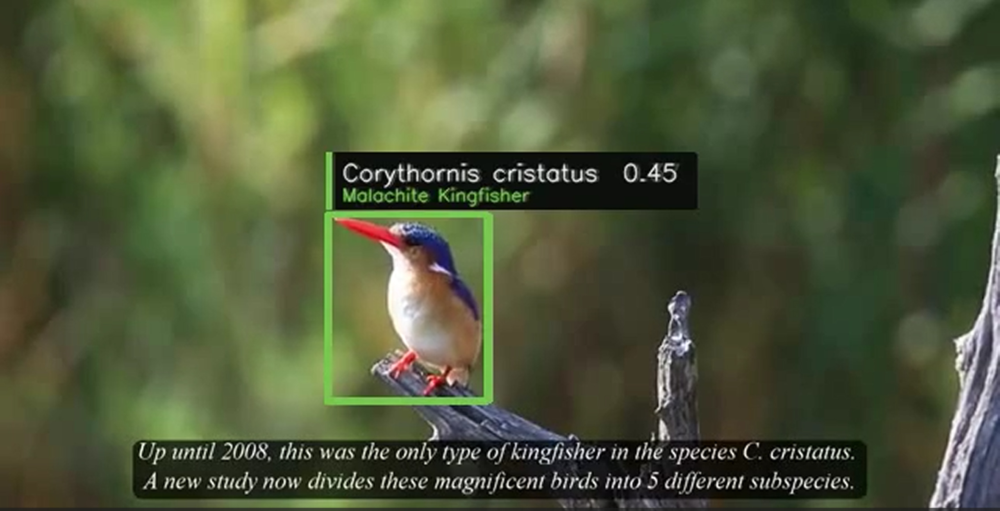

# WildLens 🦁
### Real-Time Wildlife Detection & Species Identification from Live Video

> Fine-tuning MegaDetector v5a from 3 generic classes to **500 vertebrate species** — 
> with a domain-specific auto-labeling pipeline and live video inference enriched by 
> GBIF taxonomy and IUCN conservation status.

**CSE 546 · University at Buffalo · Spring 2026**  
🔗 [Live Demo on HuggingFace Spaces](https://huggingface.co/spaces/Prateek2106/Wildlife-Detector) · 
📄 [Poster](WildLifeWatch_Poster_v2.pptx)

---

## Detections

<table>
  <tr>
    <td align="center">
      <br/>
      <b>Panthera onca</b> · Jaguar
    </td>
    <td align="center">
      <br/>
      <b>Ardea goliath</b> · Goliath Heron
    </td>
  </tr>
  <tr>
    <td align="center">
      <br/>
      <b>Oophaga pumilio</b> · Strawberry Poison-dart Frog
    </td>
    <td align="center">
      <br/>
      <b>Corythornis cristatus</b> · Malachite Kingfisher
    </td>
  </tr>
</table>

---

## The Problem

MegaDetector finds animals — but not species. SpeciesNet classifies — but doesn't 
localize or run in real time. No existing open system does both on live video streams 
with conservation context.

WildLens bridges that gap: real-time species-level detection on live wildlife footage, 
enriched with GBIF taxonomy and IUCN conservation status per detection.

---

## Key Results

| Metric | Value |
|--------|-------|
| Species covered | 500 vertebrates |
| Training images | 91,993 |
| Validation images | 8,007 |
| **mAP50** | **0.637** |
| mAP50-95 | 0.593 |
| Precision | 0.610 |
| Recall | 0.599 |
| Training | 30 epochs · A100 40GB |

Top performing species (mAP50 ≥ 0.94): Malachite Kingfisher, Goliath Heron, 
Strawberry Poison Dart Frog, Jaguar, Razor-backed Musk Turtle.

---

## Data Pipeline

**1. Collection** — 54,866 research-grade images across 500 vertebrate species via iNaturalist API  
**2. Auto-labeling** — MegaDetector v5a: 51,603 labels at 94.5% rate vs 65% with COCO-trained YOLOv8  
**3. Augmentation** — Albumentations bbox-aware transforms: +48,242 images  
**4. Training set** — 100,000 image-label pairs → fine-tune MegaDetector → `best.pt`

**Domain-specific auto-labeling was the critical insight.**  
Using MegaDetector — pretrained on 4.5M wildlife camera trap images — to label 
our own training data gave a **94.5% label rate vs 65%** with COCO-trained YOLOv8 
on the same images. That's 51,603 usable labels vs 36,544 — 15,059 more training 
examples from the same raw images.

---

## Model

Fine-tuned **MegaDetector v5a** (YOLOv5x6, 144M parameters):

- Detection head replaced: 3 generic classes → 500 species
- 955/963 pretrained weights transferred
- Backbone layers 0–9 frozen
- box_loss dropped **68% in epoch 1** — wildlife pretraining transferred immediately

---

## Ecologically Interesting Finding

*Red-billed Oxpecker* (*Buphagus erythrorynchus*) was consistently misidentified — 
not because the model failed, but because iNaturalist images of oxpeckers almost 
always show them perched on host animals (giraffes, buffalo, rhino).

The model learned **ecological co-occurrence** rather than isolated bird features. 
This suggests citizen science training distributions reflect real ecological 
relationships — which has implications for how we curate species-specific datasets 
and interpret model errors in biodiversity informatics contexts.

---

## Architecture


---

## Quick Start

```bash
git clone https://github.com/Prateek-2106/LiveStream_Animal_Detection.git
cd LiveStream_Animal_Detection
pip install -r requirements.txt

# download model weights from HuggingFace
python -c "
from huggingface_hub import hf_hub_download
hf_hub_download('Prateek2106/wildlife-detector', 'best.pt', local_dir='.')
hf_hub_download('Prateek2106/wildlife-detector', 'class_map.json', local_dir='.')
"

python app.py
```

Opens at `http://localhost:7860` — upload a video or paste a YouTube URL.

---

## Repo Structure


---

## Limitations & Open Questions

- ~110 images/species average — data-limited for rare species
- Visually similar species remain hard (leopard/jaguar, *Larus* gulls) — 
  motivates taxonomic-aware loss functions
- Context-dependent errors from citizen science distribution bias (oxpecker finding)
- Currently processes video offline — live stream inference is CPU-bottlenecked 
  without dedicated hardware

**Open research directions:**
- SAM-based region proposal replacing YOLO anchor boxes for camouflaged species
- Temporal context across frames for live stream detection
- Edge deployment (Jetson Orin Nano) for autonomous camera traps
- Expanding to 2,000+ species using LILA BC + Wildlife Insights datasets

---

## Stack

`PyTorch` · `YOLOv5` · `MegaDetector v5a` · `Gradio` · `Albumentations` · 
`iNaturalist API` · `GBIF API` · `yt-dlp` · `HuggingFace Hub`

---

## Acknowledgments

Built on [MegaDetector](https://github.com/microsoft/CameraTraps) (Microsoft AI for Earth).  
Training data sourced from [iNaturalist](https://www.inaturalist.org/) research-grade observations.  
Conservation status from [IUCN Red List](https://www.iucnredlist.org/).

---

*CSE 546 · Spring 2026 · University at Buffalo*
